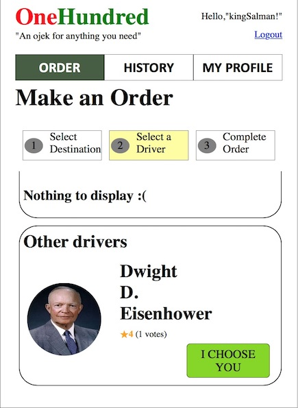

# Tugas 1 IF3110 Pengembangan Aplikasi Berbasis Web

## Deskripsi Singkat

Pada tugas besar ini, kami diminta untuk membuat aplikasi *ojek online* **berbasis web** yang memungkinkan seorang pengguna untuk menjadi penumpang dan/atau driver ojek online. Untuk menggunakan aplikasi ini, seorang pengguna harus melakukan login. Pengguna dapat menjadi penumpang maupun driver pada akun yang sama. Untuk menjadi driver, pengguna harus mengaktifkan opsi menjadi driver pada profilnya.

Kami juga diminta untuk membuat tampilan sedemikian hingga mirip dengan tampilan pada contoh. Website yang diminta tidak responsive. Desain tampilan tidak perlu dibuat indah. Icon dan jenis font tidak harus sama dengan contoh. Warna font, garis pemisah, dan perbedaan ukuran font harus terlihat sesuai contoh. Format rating dan waktu harus terlihat sesuai contoh. Perhatikan juga **tata letak** elemen-elemen.

## Anggota Tim

Dibuat oleh:
1. Husnulzaki Wibisono Haryadi 	(13515005)
2. Muhammad Umar Fariz Tumbuan 	(13515050)
3. Akmal Fadlurohman			(13515074)

## Spesifikasi

### Login

Pengguna dapat melakukan login sebagai user.

### Register

Pengguna dapat mendaftarkan diri sebagai user agar dapat menggunakan aplikasi ini. Satu user akan memiliki satu akun yang dapat digunakan sebagai penumpang maupun sebagai driver. User disediakan opsi untuk memilih apakah dia mau menjadi driver atau tidak saat registrasi. Jika email dan username valid akan ditandai dengan lambang centang. Setelah selesai register, jika pengguna tidak memilih opsi untuk menjadi driver, pengguna otomatis masuk ke halaman Order dengan keadaan sudah login. Jika pengguna memilih opsi menjadi driver, pengguna otomatis masuk ke halaman Profile dengan keadaan sudah login.

### Profile

Pada halaman ini, ditampilkan username, nama lengkap, email, dan nomor HP. Selain itu, ditampilkan keterangan apakah pengguna merupakan driver atau bukan. Jika pengguna merupakan driver, ditampilkan tulisan Driver diikuti rating dan jumlah vote.

### Edit-Profile

Pada halaman ini, pengguna dapat mengedit nama yang ditampilkan, nomor telepon, foto, dan status driver.

Status driver berupa tombol Yes/No yang dapat diklik oleh pengguna untuk mengganti.

### Edit-Preferred-Location

Pada Edit-Preferred-Location, driver bisa menambah atau mengurangi wilaya kerja mereka.

### Order-Ojek

Order-Ojek merupakan halaman utama yang ditampilkan ketika user telah login. Pada halaman Order-Ojek, terdapat sebuah form yang dapat diisi pengguna untuk melakukan order.

### Select-Driver

Pada halaman ini, ditampilkan driver-driver yang tersedia dan dapat mengambil order. Driver yang dapat mengambil order adalah pengguna yang menjadi driver, dan memiliki alamat asal atau alamat tujuan pada "Preferred Location"-nya.

### Complete-Order

### History

Pada halaman history, terdapat dua tab, yaitu History Penumpang dan History Driver. History Penumpang menampilkan daftar order yang pernah diambil pengguna sebagai penumpang, dan History Driver menampilkan daftar order yang pernah diambil pengguna sebagai driver.

### Pembagian Tugas
Tugas ini dikerjakan bersama-sama dengan saling berdiskusi dan membantu. Pembagian tanggung jawab untuk tugas ini adalah sebagai berikut

**Tampilan**
1. Login : 13515050, 13515074
2. Register : 135074
3. Order - Pilih lokasi : 13515005, 13515050
4. Order - Pilih driver : 13515005, 13515050
5. Order - Complete order : 13515005, 13515050
6. Profile : 13515074, 13515050, 13515005
7. Edit profile : 13515074 13515050
8. Edit preferred location : 13515074, 13515050
9. Driver History : 13515050
10. Transaction History : 13515050

**Fungsionalitas**
1. Login : 13515074
2. Register : 13515074
3. Order - Pilih lokasi : 13515005
4. Order - Pilih driver : 13515005, 13515050
5. Order - Complete order : 13515005
6. Profile : 13515074
7. Edit Profile : 13515074
8. Edit preferred location : 13515074
9. Driver History : 13515050
10. Transaction History : 13515050
11. Basis Data : 13515074

## About

Asisten IF3110 2016

Ade | Johan | Kristianto | Micky | Michael | Rangga | Raudi | Robert | Sashi 

Dosen : Yudistira Dwi Wardhana | Riza Satria Perdana | Muhammad Zuhri Catur Candra

